# Taller de Aplicaciones Web con Blazor WebAssembly y .Net

Este taller esta orientado a conocer lo más elemental y básico del desarrollo de aplicaciones web con Blazor WebAssembly y .Net

## Introducción

A continuación conoceremos los conceptos básicos que necesitamos dominar para poder trabajar con Blazor WebAssembly.

## Prerequisitos.

- Conocimiento en C# y .Net
- Visual Code o Visual Studio.
- Conocimientos sobre desarrollo web (HTML, CSS, JavaScript).
- .Net 6 o superior.

### ¿Qué es WebAssembly y Bazor?

#### WebAssembly.
- **Nuevo estándar web** que aparece por primera vez en el año 2015.
- Diseñado inicialmente para **C y C++**.
- Permite a **lenguajes compilados ejecutarse en el navegador** (Rust, C++, Go, C#).
- Extensiones **.wast, .wasm**
- Puede trabajar junto con **JavaScript**

#### Casos de éxito con WebAssembly.
A continuación tenemos algunos casos de éxito con WebAssembly.

[Casos de Éxito con WebAssembly](https://madewithwebassembly.com)


#### Blazor.

- Nueva tecnología para el desarrollo web.
- Sintaxis C# + HTML.
- Open Source y multiplataforma.
- Muchas librerías y apoyo de la comunidad.
- Puede trabajar junto con JavaScript.

#### Blazor WebAssembly Vs Blazor Server.

- Se ejecuta en el navegador.
- Utiliza Web Assembly para hospedarse en el navegador.
- Se ejecuta en el servidor.
- Utiliza SignalR para sincronizar los cambios.

| Preview | .NET 3.1 | .NET 5 | .NET 6 | .NET 7 |
|----------|----------|----------|----------|----------| 
| 2018   | 2019   | 2020   | 2021 | 2022 | 
| Web Assembly    | .NET core integration   | CSS Isolation   | New Template | Hot Reload Improved |
| SPA application    | Share component   | Virtualization   | Hot reload | .NET Maui |
| Visual Studio Support    | .NET Standard   | Web SDK   | AOT compilation | New Console Output |
| Mono    |    | Wasm size improved   | Error boundaries | Inject services into custom validation attributes in Blazor |
|         |    | Lazy loading    | Components for react.js and angular | | 

### Creando un proyecto de Blazor en Visual Studio.

Seguimos los siguientes pasos que se citan a continuación.

```{bash}
    dotnet new blazorwasm -n MiProyecto002
```

1. Verificamos que tengamos activado la opción **Desarrollo de ASP.Net y Web**, como se muestra en la siguiente imagen.


2. El siguiente paso es utilizar la barra de búsqueda de los tipos de proyectos y seleccionar Blazor Webassembly


3. Asignar un nombre y una ruta para almacenar el nuevo proyecto.


4. Seleccionamos el Framework con el que vamos a trabajar. Se sugiere utilizar a partir de la versión 6 en adelante.


5. Una vez creado el proyecto debemos probar que todo funciona correctamente.

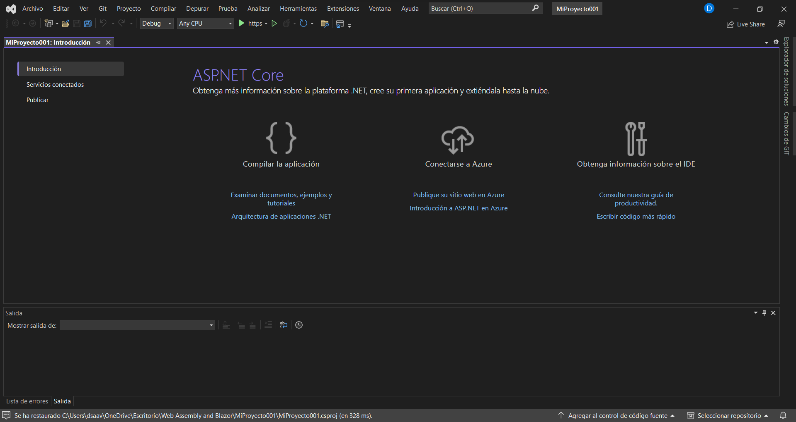

6. Una vez probado el proyecto, podemos tener la seguridad de que todo está correctamente listo para empezar.

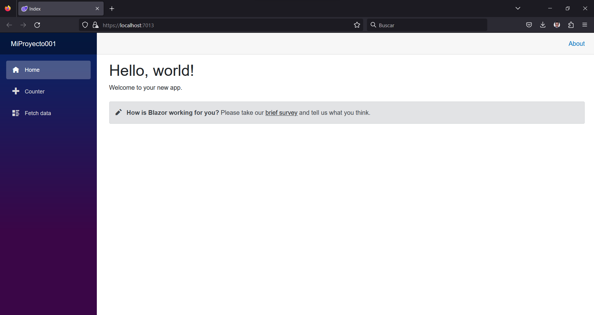

7. Finalmente verificamos tener habilitada la opción **Hot Reload** para poder trabajar con total normalidad.

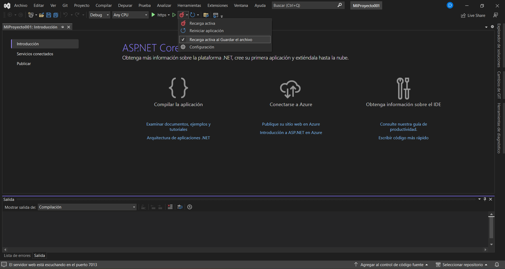

### Creando un proyecto de Blazor con CLI.

Para utilizar el CLI de .Net es necesario primero ubicarnos en la ruta a nivel de consola en donde vamos a crear el proyecto, seguido de ello utilizamos el siguiente comando.

```{bash}
dotnet new blazorwasm -n <title of project>
```


Una vez ejecutado el comando debe salir algo como la siguiente imagen.


2. Ahora es necesario verificar que el proyecto compile correctamente, para ello vamos a utilizar el comando build. Es necesario estar en la ruta dentro del proyecto creado.

```{bash}
dotnet build
```


3. Si todo ha salido bien hasta ahora, es necesario utilizar el comando run para ejecutar nuestro proyecto en un navegador.

```{bash}
dotnet run
```


4. Por comodidad es mejor trabajar desde **Visual Studio Code** ya que consume menos recursos en maquinas modestas. En estos casos se sugiere utilizar la terminal del mismo editor y utilizar el comando watch run para activar el modo **Hot Reload** y poder programar con mayor rapidez.

```{bash}
dotnet watch run
```


Esto es genial, ya que podemos hacer cambios en tiempo real y visualizarlos en el navegador.

| Sin modificación | Con modificación |
|----------|----------|
|   |    |

### Analizando extensiones de Visual para Blazor.

Ahora vamos a empezar analizando algunas extensiones para **Visual Studio Code** que nos facilitarán el trabajo de programación con Blazor.

La primera extensión que analizaremos es la extensión de C# creada por Microsoft que nos permitirá trabajar en VS Code con este lenguaje de programación.


La siguiente extensión que se sugiere utilizar es los Snippets para Blazor, de las cuales tenemos Blazor Snippet Pack y Blazor Snippets.

| Blazor Snippet Pack | Blazor Snippets|
|----------|----------|
|    |    | 

#### Demo.

Mediante estas extensiones nos será mas sencillo poder escribir código como se muestra a continuación.


En la imagen anterior podemos ver como aparecen todos los eventos que ocurren en este ciclo de vida. Estos son eventos que internamente tienen un componente y normalmente se debe crear una función para poder utilizar en estos eventos una porción de código en específico para agregar lógica al componente.

Esto nos permitirá crear esta estructura de código sin la necesidad de escribir cada uno de los detalles necesarios para utilizar por ejemplo este método.

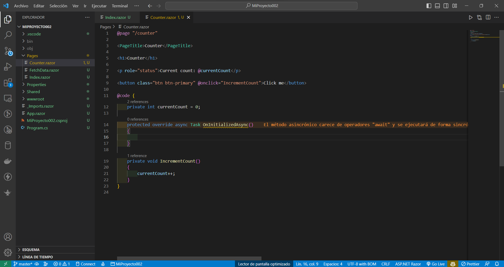

En la imagen anterior se puede visualizar lo rápido que se puede escribir código en Blazor con las extensiones utilizadas.

### Estructura de Componentes y Arquitectura en Blazor.
Vamos a analizar los componentes básicos de Blazor, es decir todos los archivos que se crearon en el template básico.

### Program.cs

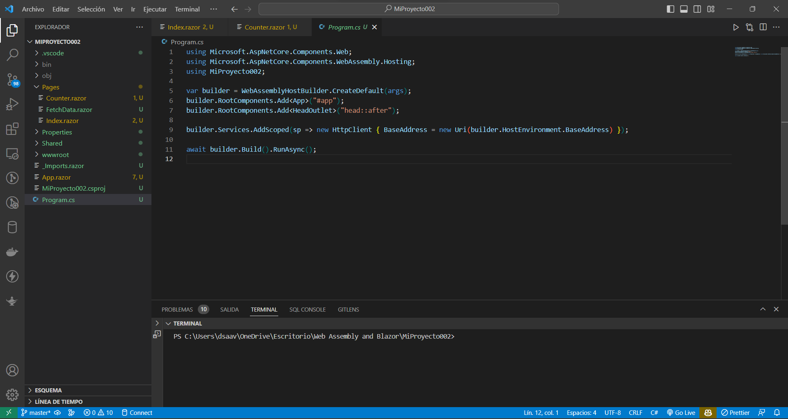

Lo que hace este archivo, es tener toda la estructura general para poder ejecutar el proyecto. Es importante resaltar, que aquí es donde se realiza la configuración de los servicios, es decir todas las dependencias que vamos a estar inyectando en la aplicación se van a configurar en este punto.

Por ejemplo como se hace con una Web de ASP, es decir una Web API de ASP.Net

### MiProyecto002.csproj


Se puede observar el Target Framework, el SDK para trabajar con BlazorWebAssembly

Se obtiene la versión del Framework, la configuración del lenguaje

Y 2 paquetes que vienen por defecto.

- Microsoft.AspNetCore.Components.WebAssembly
- Microsoft.AspNetCore.Components.WebAssembly.DevServer

En este caso ambos se utilizan para poder ejecutar el proyecto.

### App.razor

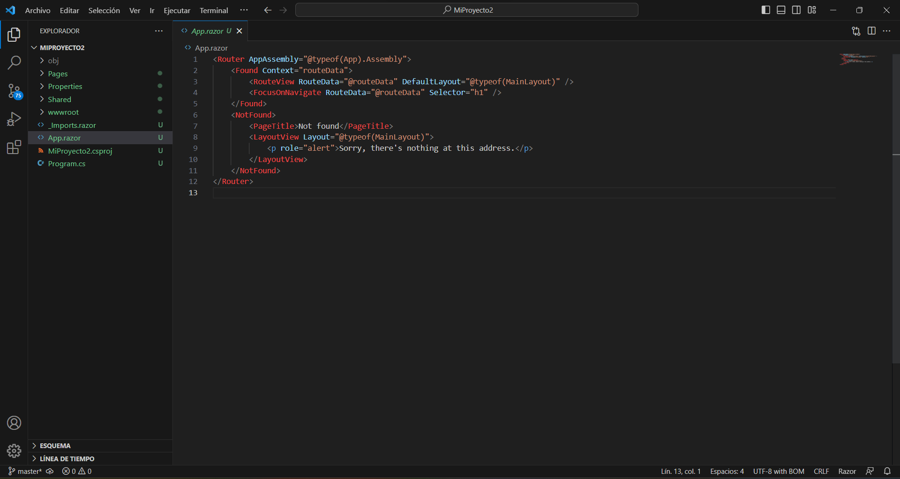

Este archivo va a contener toda aplicación y la arquitectura de componentes que vamos a ir creando.

Este archivo usualmente no se modifica, se extiende ya que se agrega nuevas configuraciones, pero normalmente debe contenerse con esta parte inicial para que pueda realizar la configuración y ejecución.

### Imports.razor

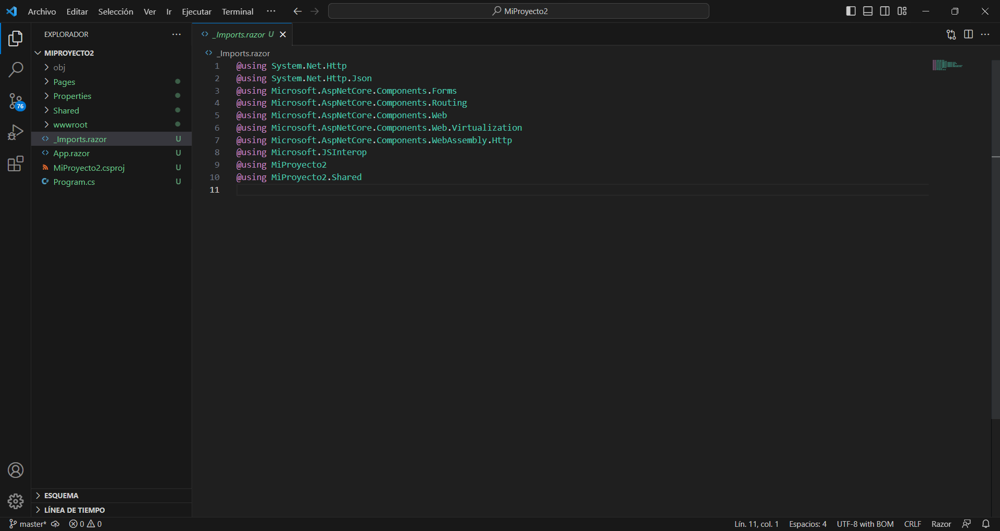

En este archivo se hace algunas declaraciones de @using, de los @using que se van a utilizar.

La ventaja que tenemos de utilizar todos los using que coloquemos aquí se los va a implementar en los complementos.

Esto evita que vayamos implementando en cada uno de los componentes, ya que es una cantidad grande de cosas comunes que se puede exponer aquí y no en cada declaración de cada componente.

De esta forma queda visible y expuesto para todos los componentes.

### Directorio wwwRoot

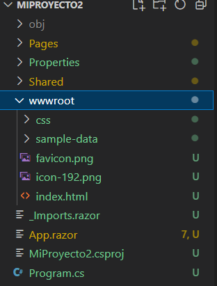

Esta carpeta es clásica en .NET donde se almacenan los archivos estáticos del proyecto, por ejemplo los archivos css, html, carpetas de imágenes, iconos, etc.

Existe un solo archivo index.html, esto quiere decir que es un SPA, un simple page application. En donde un único archivo html contiene toda la aplicación, la interfaz va cambiando en base a lo que el usuario va haciendo, los botones que va seleccionando, etc. 

### Directorio Shared

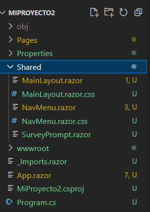

Este directorio tiene los componentes compartidos. Este es un concepto que lo veremos más adelante, pero es un concepto que se utiliza en Blazor para poder reutilizar componentes.

Hablamos de componentes genéricos que queremos utilizar en diferentes partes.

### Directorio Properties.

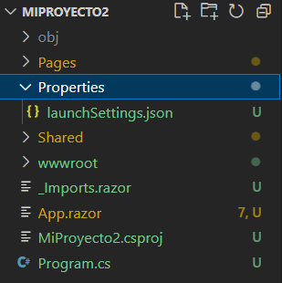

La configuración de como se va a ejecutar la aplicación.

### Directorio Pages.


Aquí se encuentran los componentes que se van a utilizar en la aplicación. Por defecto vienen 3 componentes.

- **Counter.Razor:** Es un componente que viene por defecto, es un componente que tiene un contador, que tiene un botón para incrementar y otro para decremental.
- **FetchData.Razor:** Es un componente que viene por defecto, es un componente que lista una tabla.
- **Index.Razor:** Es un componente que viene por defecto, es un componente que es el home de la aplicación.

### Analizando la estructura de un componente.

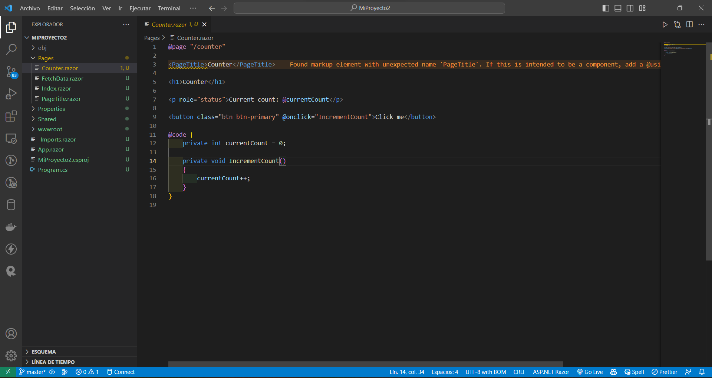1

Lo más importante de un componente es entender su estructura general, por ejemplo empezamos con un **@page**, que es la ruta que va a tener el componente.

También es importante conocer el PageTitle, que es el título que va a tener el componente.

En esta sección vamos a tener toda la estructura del componente en sí, es decir el HTML, el CSS y C#. Cada vez que vayamos a utilizar C# se debe utilizar **@** para poder empezar a escribir y al momento que se compile la aplicación sepa que se va a ejecutar código de C#.

Por otra parte es importante conocer el **@code** y un **@code** es donde se va a escribir el código de C#.

También es importante conocer los eventos como @onclick, @onchange, etc. Estos eventos son los que se van a ejecutar en el componente. Es importante reconocer que por ejemplo en el evento @onclick se debe colocar un método que se va a ejecutar cuando se haga click en el botón.

Si analizamos el componente de index.razor, podemos ver que tiene un **@page** que es la ruta que va a tener el componente, también tiene un **@page** que es el título que va a tener el componente. Pero no contiene un **@code** ya que no tiene código de C#.

### Ciclo de Vida en Componentes y Parámetros.

El ciclo de vida se refiere a los **eventos que ocurren desde que se crea un componente hasta que se renderiza** en la interfaz.


#### Lista de Eventos.

- SetParametersAsync.
- OnInitialized{Async}.
- OnAfterRenderAsync (Manejo de notificaciones, login, guardar en la bitácora, cosas extra que se puede hacer cuando el componente ha sido renderizado).
- OnParametersSet{Async}.
- StateHasChanged (Cuando ha cambiado algo dentro del componente y la interfaz se va a refrescar).

[Revisar la Documentación Oficial.](https://learn.microsoft.com/en-us/aspnet/core/blazor/components/lifecycle?view=aspnetcore-7.0)

#### Demo


```{razor}

@page "/counter"
@inject ILogger<Counter> logger;

<PageTitle>Counter</PageTitle>

<h1>Counter</h1>

<p role="status">Current count: @currentCount</p>

<button class="btn btn-primary" @onclick="IncrementCount">Click me</button>

@code {
    private int currentCount = 0;

    protected override void OnParametersSet()
    {
        logger.LogInformation("Se envian los parametros");
    }

    protected override void OnAfterRender(bool firstRender)
    {
        logger.LogInformation("esto ocurre despues de iniciar el componente");
    }

    private void IncrementCount()
    {
        currentCount++;
    }
}
```

Ahora revisamos la sección de parámetros en nuestro código.

```{blazor}
@page "/counter/{currentCountParameter?}"
@inject ILogger<Counter> logger;

<PageTitle>Counter</PageTitle>

<h1>Counter</h1>

<p role="status">Current count: @currentCount</p>

<button class="btn btn-primary" @onclick="IncrementCount">Click me</button>

@code {
    private int currentCount = 0;

    [SupplyParameterFromQuery]
    [Parameter]

    //public string? currentCountParameter {get;set;}
    public string? CountryFromQuery {get;set;}

    public override async Task SetParametersAsync(ParameterView parameters)
    {
        if (parameters.TryGetValue<string>(nameof(currentCountParameter), out var value))
        {
            if (value is not null)
                currentCountParameter = value;
        }
    
        await base.SetParametersAsync(parameters);
    }

    protected override void OnParametersSet()
    {
        logger.LogInformation("Se envian los parametros");
    }

    protected override void OnInitialized()
    {   
        //currentCount = currentCountParameter != null ? int.Parse(currentCountParameter) : 0;
        currentCount = counterFromQuery != null ? int.Parse(counterFromQuery) : 0;
        logger.LogInformation("Se inicializa el componente");
    }

    protected override void OnAfterRender(bool firstRender)
    {
        logger.LogInformation("esto ocurre despues de iniciar el componente");
    }

    private void IncrementCount()
    {
        currentCount++;
    }
}
```

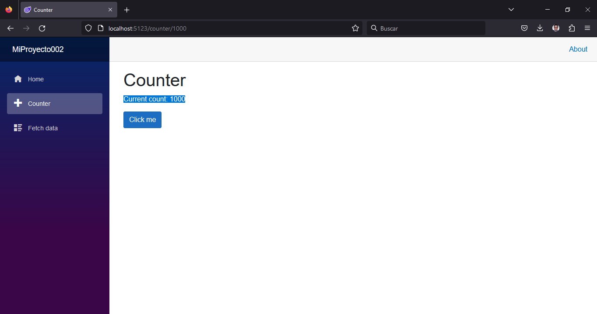

En nuevas versiones de código se aconseja utilizar este nuevo parámetro

```{blazor}
@page "/counter/{currentCountParameter?}"
@inject ILogger<Counter> logger;

<PageTitle>Counter</PageTitle>

<h1>Counter</h1>

<p role="status">Current count: @currentCount</p>

<button class="btn btn-primary" @onclick="IncrementCount">Click me</button>

@code {
    private int currentCount = 0;

    [Parameter]
    public string? currentCountParameter {get;set;}

    [SupplyParameterFromQuery]
    [Parameter]
    public string? CounterFromQuery {get;set;}

    public override async Task SetParametersAsync(ParameterView parameters)
    {
        if (parameters.TryGetValue<string>(nameof(currentCountParameter), out var value))
        {
            if (value is not null)
                currentCountParameter = value;
        }
    
        await base.SetParametersAsync(parameters);
    }

    protected override void OnParametersSet()
    {
        logger.LogInformation("Se envian los parametros");
    }

    protected override void OnInitialized()
    {
        //currentCount = currentCountParameter!= null ? int.Parse(currentCountParameter) : 0; 
        currentCount = CounterFromQuery!= null ? int.Parse(CounterFromQuery) : 0;
        logger.LogInformation("Se inicia el componente");
    }

    protected override void OnAfterRender(bool firstRender)
    {
        logger.LogInformation("esto ocurre despues de iniciar el componente");
    }

    private void IncrementCount()
    {
        currentCount++;
    }
}
```


Ejemplo de como se pasa el parametro con el QueryString

```{bash}
http://localhost:5123/counter?CounterFromQuery=200
```

### Creando Componentes Compartidos.

Una de las caracteristicas de los componentes compartidos es que no existe una ruta para ellos, por lo que no se puede acceder a ellos directamente.

El componente SurveyPrompt es un componente compartido. Se puede acceder a él desde cualquier página, pero no tiene una ruta de página asociada. En este caso podemos observer que en su secci'on @code crea un string? que se llama Title y se invoca mediante @Title.


Siempre que se crea un componente compartido es porque se va a reutilizar en varias partes de la aplicación.

En el caso del titulo se puede crear un componente compartido para reutilizar código y el mismo puede ser una imagen por ejemplo que serviría para reutilizarlo.

## Demo

Creando un componente compartido para el titulo.


```{razor}
<h1>@Title</h1>


@code
{
    [Parameter]
    public string Title {get; set;}
}
```

Ahora lo podemos reutilizar en cualquier componente, la sintaxis que remplazaría al titulo es la siguiente.

```{razor}
<ModuleTitle Title="Hello, world!" />
```
### Creando Archivo de Configuración.

En el directorio wwwroot se crea un archivo llamado appsettings.json

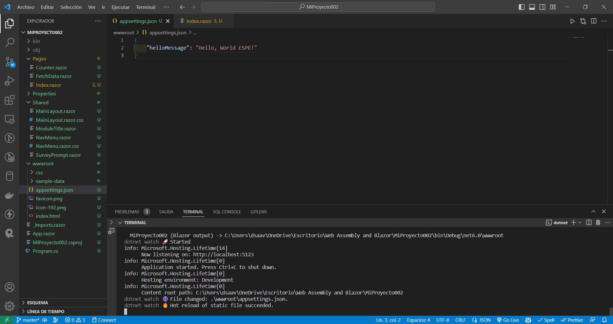

```{json}

Esta configuración se puede cambiar
{
    "Title": "Hello, world ESPE!"
}
```


Codigo del archivo Index.razor

```{razor}
@page "/"
@inject IConfiguration config

<PageTitle>Index</PageTitle>

<ModuleTitle Title="@HelloMessage" />

Welcome to your new app.

<SurveyPrompt Title="How is Blazor working for you?" />

@code
{
   public string HelloMessage = "";

   protected override void OnInitialized()
   {
      HelloMessage = config["helloMessage"];
   }
}
```

<!-- ## Conectando Blazor a Backend.

### Configurando conexión al backend para el proyecto.

### Creando Componentes para la conexión a la API.

### Mostrando lista de productos.

### Creando Menú y CSS para la lista de productos.

### Integrando formulario con servicios  

## Usando Librerías de Blazor.

### Creando funcionalidad de eliminar usando javascript.

### Usando Librerías Blazor.-->